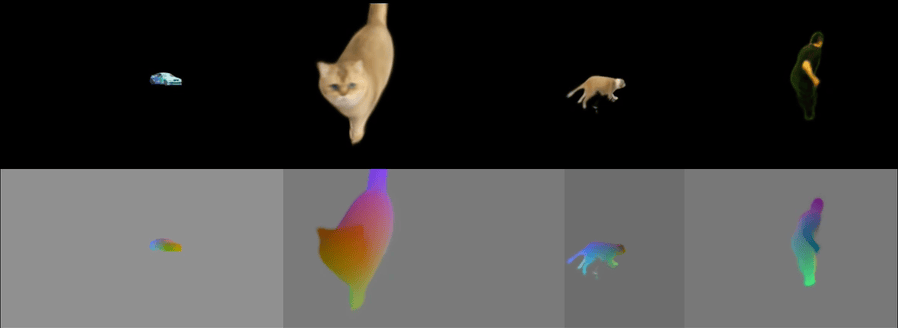

<p>
  <picture>
  
  </picture>
</p>

# Lab4D
**[[Docs & Tutorials](https://lab4d-org.github.io/lab4d/)]**
**[[Data & Checkpoints](https://lab4d-org.github.io/lab4d/data_models.html)]**

*This is an alpha release and the APIs are subject to change. Please provide feedback and report bugs via github issues. Thank you for your support.*

## About
**Lab4D** is a framework for 4D reconstruction from monocular videos. The software is licensed under the MIT license. 
<p>
  <picture>
  
  </picture>
</p>


## TODOs
- [ ] more data and checkpoints
- [ ] feedforward models
- [ ] web viewer
- [ ] evaluation and benchmarks
- [ ] multi-view reconstruction

## Acknowledgement
- Our pre-processing pipeline is built upon the following open-sourced repos: 
  - Segmentation: [Track-Anything](https://github.com/gaomingqi/Track-Anything), [MinVIS](https://github.com/NVlabs/MinVIS)
  - Feature & correspondence: [DensePose-CSE](https://github.com/facebookresearch/detectron2/blob/cbbc1ce26473cb2a5cc8f58e8ada9ae14cb41052/projects/DensePose/doc/DENSEPOSE_CSE.md), [DINOv2](https://github.com/facebookresearch/dinov2), [VCNPlus](https://github.com/gengshan-y/rigidmask)
  - Depth: [ZoeDepth](https://github.com/isl-org/ZoeDepth)
  - Camera: [BANMo-viewpoint](https://github.com/facebookresearch/banmo)
- We use [dqtorch](https://github.com/MightyChaos/dqtorch) for efficient rotation operations
- We thank [@mjlbach](https://github.com/mjlbach), [@alexanderbergman7](https://github.com/alexanderbergman7), and [@terrancewang](https://github.com/terrancewang) for testing and feedback
- We thank [@jasonyzhang](https://github.com/jasonyzhang), [@MightyChaos](https://github.com/MightyChaos), [@JudyYe](https://github.com/JudyYe), and [@andrewsonga](https://github.com/andrewsonga) for feedback

If you use this project for your research, please consider citing the following papers. 

For building deformable object models, cite:
<details>

```
@inproceedings{yang2022banmo,
  title={BANMo: Building Animatable 3D Neural Models from Many Casual Videos},
  author={Yang, Gengshan and Vo, Minh and Neverova, Natalia and Ramanan, Deva and Vedaldi, Andrea and Joo, Hanbyul},
  booktitle = {CVPR},
  year={2022}
}  
```
</details>

For building category body and pose models, cite:
<details>

```
@inproceedings{yang2023rac,
    title={Reconstructing Animatable Categories from Videos},
    author={Yang, Gengshan and Wang, Chaoyang and Reddy, N. Dinesh and Ramanan, Deva},
    booktitle = {CVPR},
    year={2023}
} 
```
</details>

For object-scene reconstruction and extreme view synthesis, cite:
<details>

```
@article{song2023totalrecon,
  title={Total-Recon: Deformable Scene Reconstruction for Embodied View Synthesis},
  author={Song, Chonghyuk and Yang, Gengshan and Deng, Kangle and Zhu, Jun-Yan and Ramanan, Deva},
  journal={arXiv},
  year={2023}
}
```
</details>

For training feed-forward video/image shape and pose estimators, cite:
<details>

```
@inproceedings{tan2023distilling,
  title={Distilling Neural Fields for Real-Time Articulated Shape Reconstruction},
  author={Tan, Jeff and Yang, Gengshan and Ramanan, Deva},
  booktitle={CVPR},
  year={2023}
}
```
</details>

For the human-48 dataset cite:

<details>

```
@incollection{vlasic2008articulated,
  title={Articulated mesh animation from multi-view silhouettes},
  author={Vlasic, Daniel and Baran, Ilya and Matusik, Wojciech and Popovi{\'c}, Jovan},
  booktitle={Acm Siggraph 2008 papers},
  pages={1--9},
  year={2008}
}
@article{xu2018monoperfcap,
  title={Monoperfcap: Human performance capture from monocular video},
  author={Xu, Weipeng and Chatterjee, Avishek and Zollh{\"o}fer, Michael and Rhodin, Helge and Mehta, Dushyant and Seidel, Hans-Peter and Theobalt, Christian},
  journal={ACM Transactions on Graphics (ToG)},
  volume={37},
  number={2},
  pages={1--15},
  year={2018},
  publisher={ACM New York, NY, USA}
}
@inproceedings{perazzi2016benchmark,
  title={A benchmark dataset and evaluation methodology for video object segmentation},
  author={Perazzi, Federico and Pont-Tuset, Jordi and McWilliams, Brian and Van Gool, Luc and Gross, Markus and Sorkine-Hornung, Alexander},
  booktitle={Proceedings of the IEEE conference on computer vision and pattern recognition},
  pages={724--732},
  year={2016}
}
```
</details>
